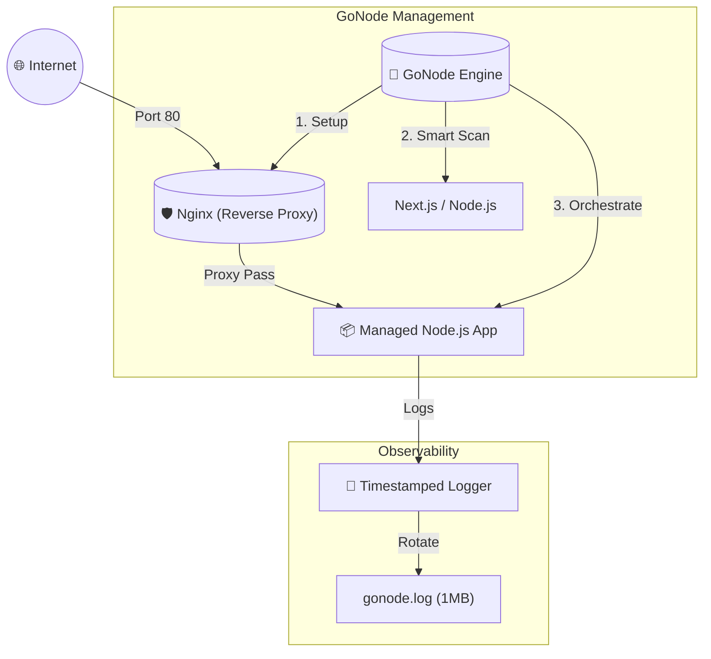

# 🚀 GoNode - Adaptive Infrastructure Engine

[](https://golang.org)
[](https://nodejs.org)
[](#)

GoNode is a high-performance orchestration engine that manages Node.js applications and automates Nginx reverse proxy configurations.

---

## 📐 Application Flow

GoNode sits between your OS and your Application, acting as the supervisor that even automates Nginx for you.



---

## ✨ Features

- **Nginx Automation**: Automatically generate and apply Nginx reverse proxy configs for your domains
- **DNS Propagation Check**: Use `gonode check propagation` to verify if your domain points to your IP
- **Smart AI Detection**: **Smart Scan** identifies if your app is Frontend (Next.js/React) or Backend
- **Adaptive Profiles**: Select hardware-optimized specs (Eco, Balanced, Power)
- **Daemon Mode**: Runs in the background, detached from your terminal
- **Log Management**: Precise timestamps and automatic rotation at 1MB

---

## 📂 Project Structure

```text
GoNode/
├── cmd/
│   └── gonode/        # CLI Entry Point (main.go)
├── pkg/
│   ├── engine/        # Logic: cli, daemon, detector, nginx
│   ├── logger/        # Logging & Rotation
│   └── utils/         # UI & Installer
├── docs/              # PRD & Documentation
├── examples/          # Example Node.js App
├── setup.sh           # Environment Setup (Go, Node, Nginx)
└── install.sh         # Binary Builder
```

---

## 🚀 Quick Start

### 1. Environment Setup
```bash
./setup.sh
```

### 2. Build & Global Setup
```bash
./install.sh
```
> During installation, choose **'y'** when asked to make `gonode` global.

### 3. Launch from Anywhere
Now you can go to your project folder and run:
```bash
gonode start
```
1. Select **RAM Profile**
2. Select **App Type** (use Smart Scan)
3. Confirm Launch
4. Select **Yes** for **Nginx Setup**
5. Choose **Exposure Type**: **Public** (Domain) or **Local** (IP)
6. Follow the prompts and monitor the automated setup

---

Developed with ❤️ by **Rayhan Dita Adam**
