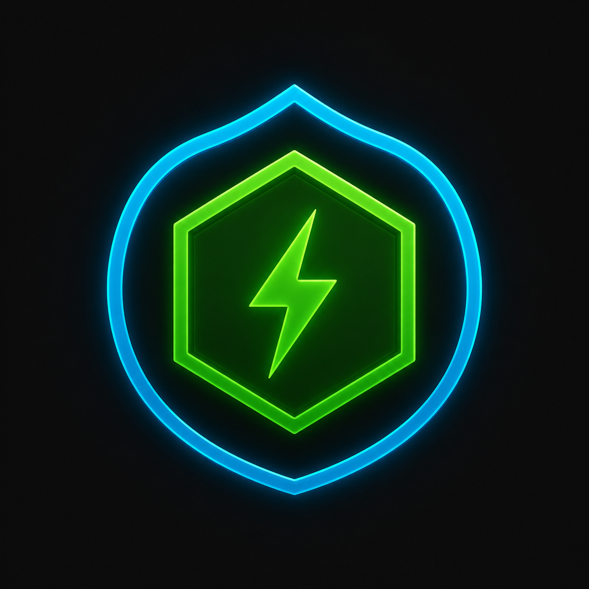
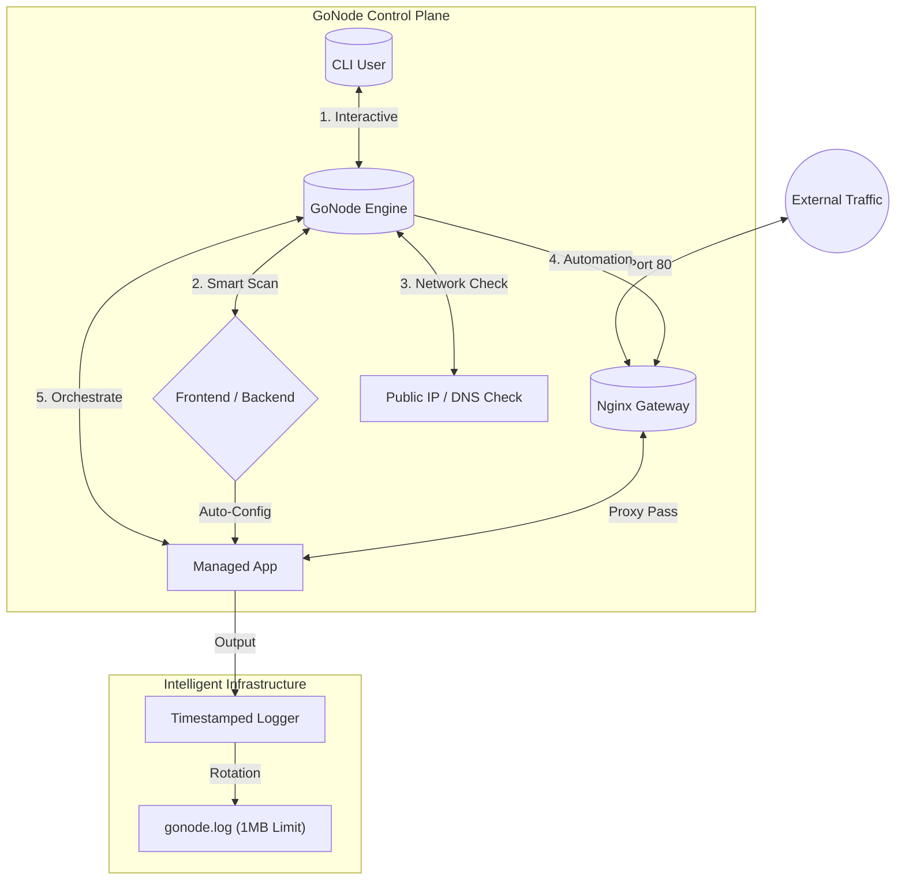

<p align="center">
  
</p>

# GoNode - Adaptive Infrastructure Engine

[](https://golang.org)
[](https://nodejs.org)
[](#)

An automated orchestration engine for Node.js designed to eliminate manual Nginx configurations. It acts as an intelligent entry-point that dynamically allocates system resources based on adaptive hardware profiles through an interactive CLI.

---

## System Architecture



---

## Key Features

- **Smart IP Detection**: Automatically fetches your server's Public IP for instant access without a domain
- **Nginx Automation**: Automatically generate and apply Nginx configs for Public (Domain) or Local (IP) access
- **SSL Automation**: One-click Let's Encrypt SSL setup when using a domain (automatically skipped for IP-based access)
- **DNS Propagation Check**: Integrated tool to verify if your domain points to your server before setup
- **Smart AI Detection**: Smart Scan identifies if your app is Frontend (Next.js/React) or Backend (Node.js)
- **Adaptive Profiles**: Select hardware-optimized specs (Eco, Balanced, Power) with one click
- **Daemon Mode**: Runs in the background, detached from your terminal using Unix Sockets
- **Log Management**: High-precision timestamps and automatic log rotation at 1MB

---

## Project Structure

```text
GoNode/
├── cmd/
│   └── gonode/        # CLI Entry Point (main.go)
├── pkg/
│   ├── engine/        # Logic: cli, daemon, detector, nginx
│   ├── logger/        # Logging & Rotation
│   └── utils/         # UI & Network Helpers
├── docs/              # Guides & Requirements
├── examples/          # Example Node.js App
├── setup.sh           # Environment Setup (Go, Node, Nginx)
├── install.sh         # Binary Builder & Global Setup
└── README.md
```

---

## Quick Start

### 1. Environment Setup
```bash
./setup.sh
```

### 2. Build & Global Setup
```bash
./install.sh
```
> Choose 'y' when asked to make gonode global

### 3. Launch from Anywhere
Go to your project folder and run:
```bash
gonode start
```
1. Select RAM Profile
2. Select App Type (use Smart Scan)
3. Confirm Launch
4. Select Yes for Nginx Setup
5. Choose Exposure Type: Public (Domain) or Local (IP)
6. GoNode automatically detects your Public IP if Local is selected
7. If using a domain, GoNode will offer to setup SSL via Let's Encrypt

### 4. Monitoring
```bash
gonode list
```

---

## Development Workflow

To maintain code quality and stability, we follow a branching model:

- **`main`**: Production-ready code. Only stable releases should be here.
- **`staging`**: Pre-production environment for final testing and QA before releasing to `main`.
- **`development`**: Integration branch for new features and bug fixes.
- **`feature/*`**: Temporary branches for developing specific features.

### How to contribute:
1. Fork the repository.
2. Create a feature branch from `development` (`git checkout -b feature/amazing-feature`).
3. Commit your changes.
4. Open a Pull Request to `development`.

---

## License

This project is licensed under the MIT License - see the [LICENSE](LICENSE) file for details.
