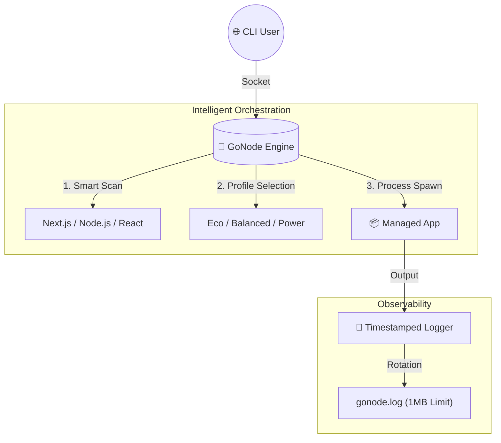

# 🚀 GoNode - Adaptive Infrastructure Engine

[](https://golang.org)
[](https://nodejs.org)
[](#)

GoNode is a high-performance orchestration engine written in Go, designed to manage, monitor, and scale Node.js applications with adaptive resource profiling.

---

## ✨ New: Smart AI Detection
GoNode now features **Smart Scan**, a heuristic-based detection system that automatically identifies your project type:
- **Frontend**: Detects Next.js or React and configures `npm start` automatically.
- **Backend**: Scans for `app.js`, `server.js`, or `index.js` and configures the Node.js runtime.

---

## 📐 High-Level Architecture



---

## 📂 Project Structure (Modular Design)

```text
GoNode/
├── main.go            # Entry Point
├── pkg/
│   ├── engine/        # Core: cli.go, daemon.go, detector.go
│   ├── logger/        # Logging & Rotation logic
│   └── utils/         # UI & Installer Helpers
├── setup.sh           # Environment Setup
└── install.sh         # Build Script
```

---

## 🚀 Quick Start

### 1. Setup Environment
```bash
chmod +x setup.sh && ./setup.sh
```

### 2. Launch with Smart Scan
```bash
go run main.go start
```
> Select **Smart Scan (AI Detect)** to let GoNode automatically configure your app!

### 3. Monitor
```bash
./gonode list
```

---

Developed with ❤️ by **Rayhan Dita Adam**
